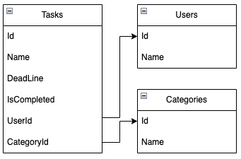
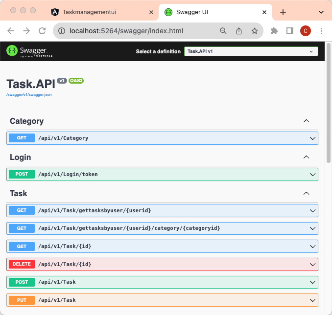
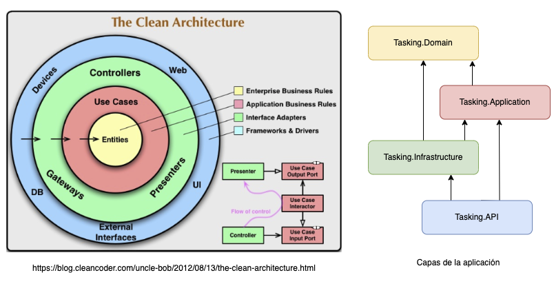
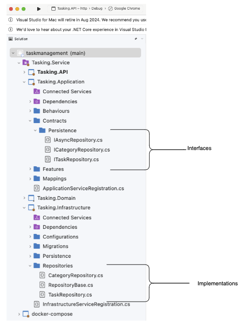
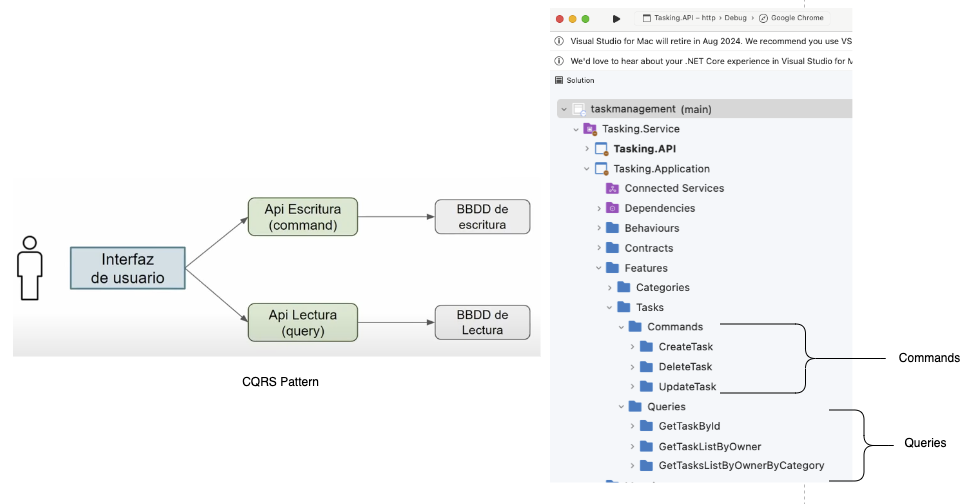
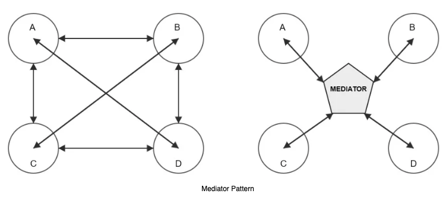
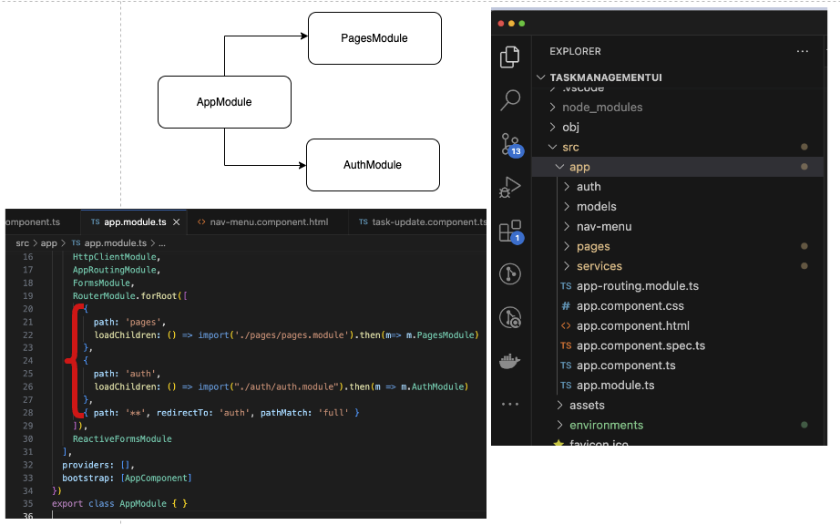
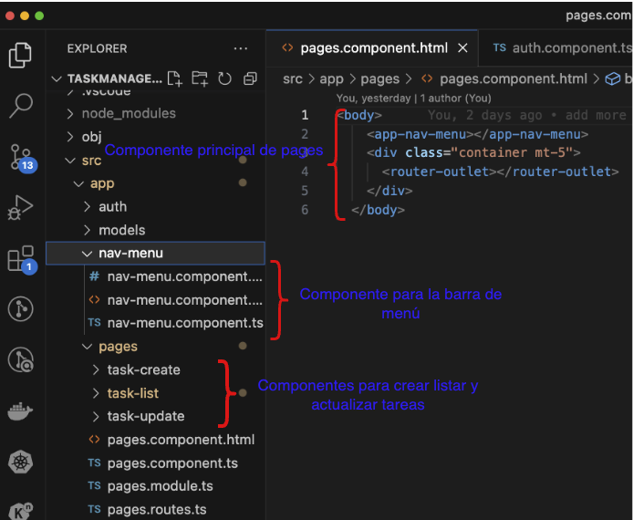
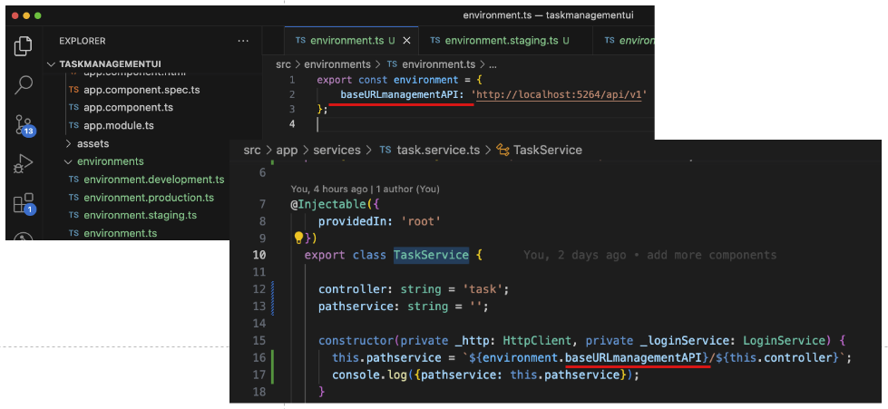
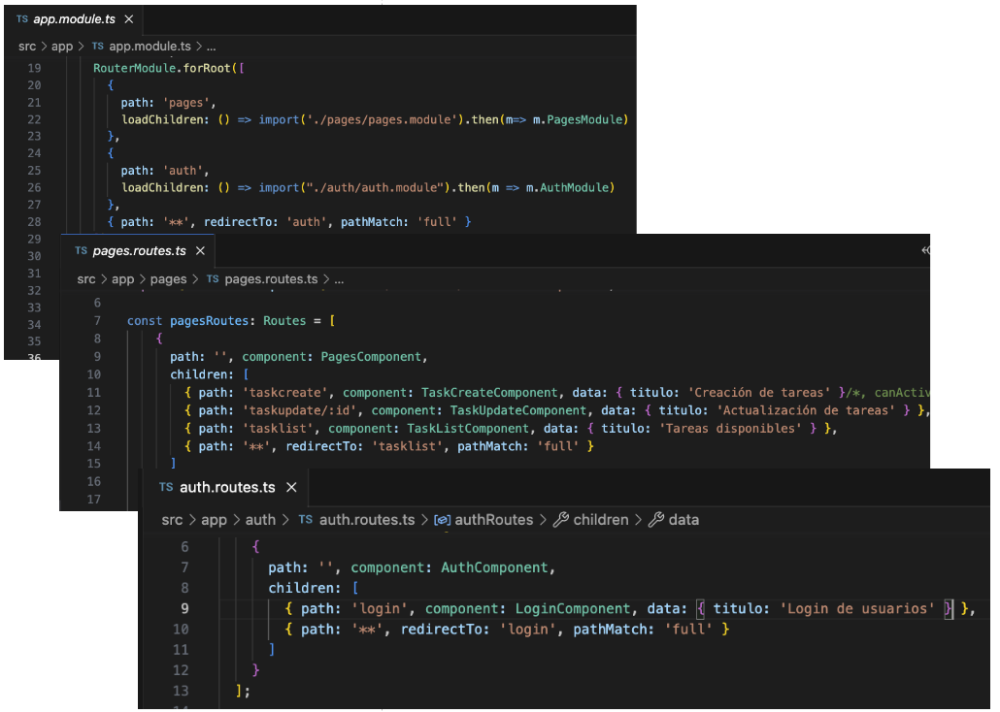

# Requerimientos de la aplicación
Aplicación para gestión de tareas en donde se permita a los usurios crear tareas, las tareas pueden tener categoría, fecha límite de entrega, los usuarios pueden marcar las tareas como completadas, también es posible filtrarlas por categoría.

[Ver Capturas de pantalla de la aplicación](resources_ui/README.md)

# Diagrama de base datos

Para la aplicación se utilizó sql server usando el siguiente diagrama:



# Setup de la aplicación

Se utilizó sql server y entity framework, se requiere correr la primera migración desde la capa de infrastructure.

```bash
# Ir a
cd src/TaskService/Tasking.Infrastructure
# Instalar herramienta de entity framework para correr las migraciones si no está instalado
dotnet tool install --global dotnet-ef
# Creación de base de datos y de las tablas necesarias usando TaskContextDev para fines de desarrollo
ef --startup-project . database update -c Tasking.Infrastructure.Persistence.TaskContextDev
```

Para este proyecto se usó una imagen de docker de sql server, [ver para configurar](resources_container_sqlserver/README.md).


# Web API
## Generalidades:

Se siguieron recomendaciones de arquitecturas Domain Driven Design y [clean arquitecture](https://blog.cleancoder.com/uncle-bob/2012/08/13/the-clean-architecture.html), se utilizó la versión 7 de .NET versión 7, se usó Entity Framework con el enfoque code first, se implementó CQRS usando paquetes como MediaTR, FluentValidation y AutoMapper, se trabajó una base de datos en SqlServer.
## End Points
Servicios expuestos:



## Estructura de capas



Domain Drive Design y arquitectura limpia coinciden en que son una colección de principios, patrones de diseño y buenas prácticas que ayudan a organizar el código de tal manera que sea entendible, testeable, y fácil de mantener en el tiempo.

Se crearon 4 capas en la aplicación, haciendo una equivalencia como se muestra en la imagen, las flechas indican la dependencia entre las capas, una de los principales puntos de **Clean Arquitecture** es la regla de la dependencia en donde las dependencias del código solo pueden provenir de los niveles externos hacia dentro y las capas externas no deben tener conocimiento de las funciones de las capas externas.

Manteniendo la regla de la dependencia se mantienen las capas fáciles de reemplazar en caso de que se requiere y se mantiene el principio de separación de preocupaciones (IoC separation of concerns).

**El principio de inversión de dependencia** se logra implementando abstracciones a través de interfaces, por ejemplo en una aplicación tradicional en capas, la capa de Applicación posiblemente necesite acceder a la capa de infrastructure para almacenar un registro en la base de datos (y la relación es directa, application necesita de infrastructure), por ejemplo aplicando **El principio de inversión de dependencia** en este proyecto se definió el patrón Repository definiendo las operaciones para que la capa de infrastructura implemente como se ve en la imagen.



Siguiendo buenas prácticas recomendadas por la industria se implementó el patrón **CQRS (Command query responsibility segregation)** que significa separar la responsabilidad entre lecturas y comandos (escritura/actualización), esto incluye en separar la lógica de la aplicación, incluyendo al código y a la ubicación de los datos.
En ambientes distribuidos una de las grandes ventajas de usar CQRS es que se puede escalar solo una parte de la aplicación.



El patrón **Mediador** permite reducir las dependencias directas entre objetos con la deficinición de un objeto que encapsula un conjunto de objetos que interactúan entre sí, los objetos no se comunican de forma directa entre ellos, se comunican a través del objeto mediador. Para la implementación de **CQRS** se usó el paquete **MediatR** que implementa el patrón mediador. Desde el Controlador del API **MediatR** recibe comandos, consultas y redirecciona a los manejadores correspondientes.




# Interfaz de usuario

[Código fuente de la interfaz de usuario](https://github.com/caro1853/taskmanagementui)

Para el front de la aplicación se utilizó Angular versión 16.

## Lazy Load

Cuando se abre un sitio web el navegador carga todos los datos necesarios para mostrarlo al usuario, lo que el usuario ve y lo que no, angular permite la carga diferida o **LazyLoad** mediante la creación de diferentes módulos y cargarlos solo cuando es requerido, en este proyecto se están usando 3 módulos, **AppModule** que es el módulo raiz para proporcionar el arranque de la aplicación, **PagesModule** que incluye las páginas o componentes como la administración de las tareas y **AuthModule** que incluye la página para la autenticación de usuarios:



## Pages Componentes

* PagesComponent: Componente principal dentro de pages que se encarga de renderizar los componentes de crear, listar y actualizar tareas, incluyendo una barra de menú nav-menu



## Comunicación con el back

Se utilizaron los servicios para hacer peticiones http a la api para obtener la información. Se crearon 3 servicios, **TaskService** para acceder a los endpoint expuestos en el controlador **Task** en el API,  **CategoryService** para acceder a los endpoints expuestos en el controlador **Category** en el API, **LoginService** permite acceder a los endpoints dentro de login y realizar operaciones relacionadas con validación usuarios.

## Environments

Dentro de cada servicio se requiere indicar la url para acceder al API, se usó Angular CLI `ng generate environments` para la generación de los ambientes:



## Estilos CSS

Se incluyó bootstrap y fontawesome para mejorar el estilo de la aplicación.

## Formularios Reactivos

Los formularios son utilizados para la captura de información, angular cuenta con los formularios reactivos, que son objetos que se componen de dos partes: los objetos que viven en el componente para almacenar y gestionar el formulario, y la visualización que vive en la plantilla, en este proyecto se utilizaron formularios reactivos para la creación de tareas y para la actualización de tareas.

## Rutas

Las rutas en angular permite definir cómo los usuarios navegan dentro de la aplicación, dentro del proyecto se definieron las rutas dentro de cada módulo:




Ejemplo de navegación:

* http://localhost:4200/auth/login
* http://localhost:4200/pages/tasklist
* http://localhost:4200/pages/taskcreate
* http://localhost:4200/pages/taskupdate/8

