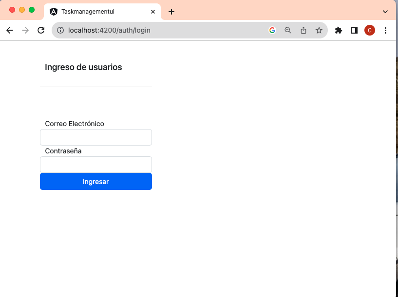
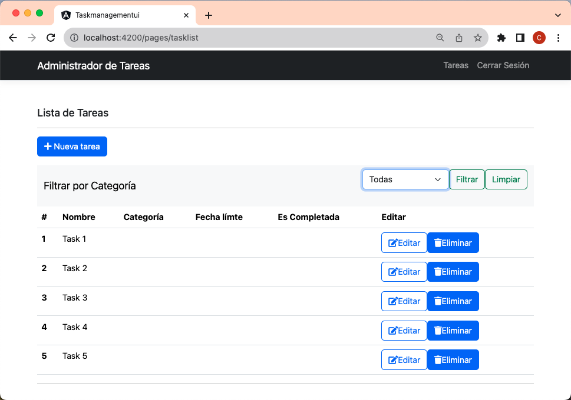
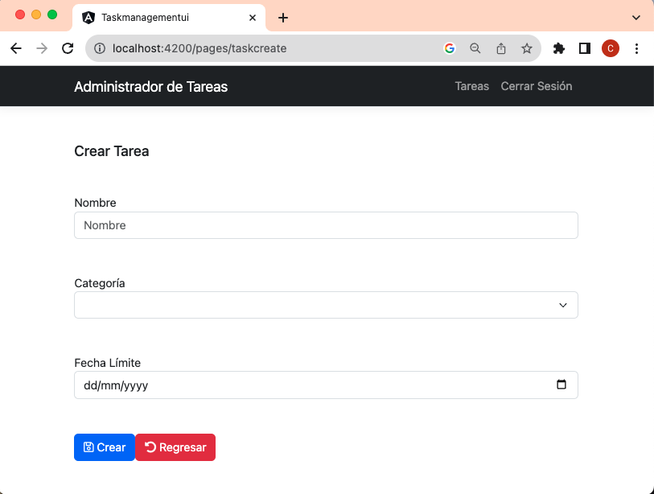
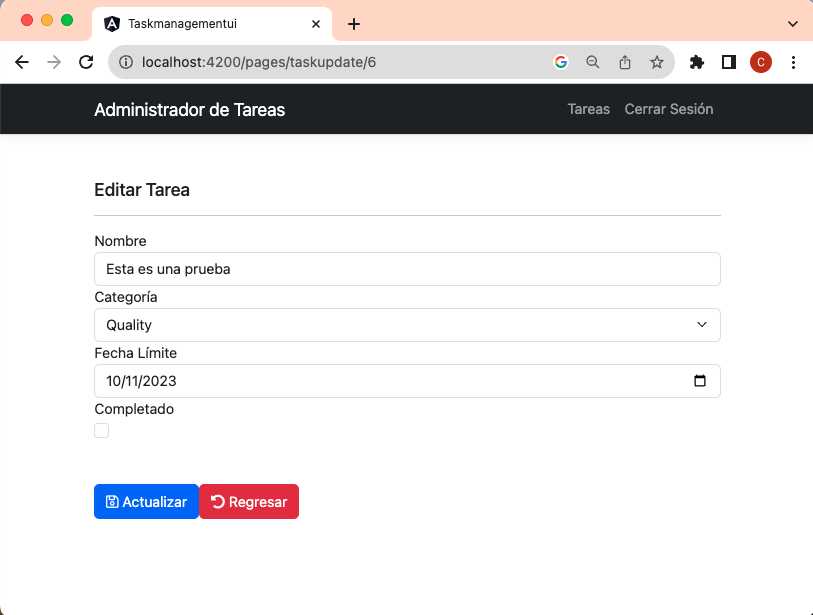
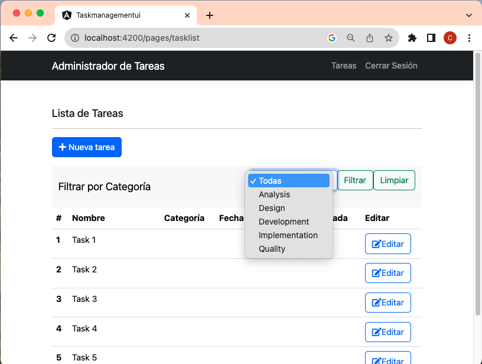

# Login de la aplicación

Se permite el ingreso del usuario admin y contraseña admin para efecto de pruebas, el usuario tiene el id 58 que es asignado en el web API.

---
## [Regresar](../README.md)
---

# Listar tareas

En este módulo se listan las tareas almacenadas para el usuario logueado permitiendo crear, editar o eliminar una tarea, también es posible filtrarla por categoría.

---
## [Regresar](../README.md)
---

# Crear Tarea

Permite la creación de una tarea con el nombre como valor requerido.

---
## [Regresar](../README.md)
---

# Editar Tarea

Permite la edición de una tarea incluyendo el campo completado.

---
## [Regresar](../README.md)
---

# Filtrar Tareas por categoría

